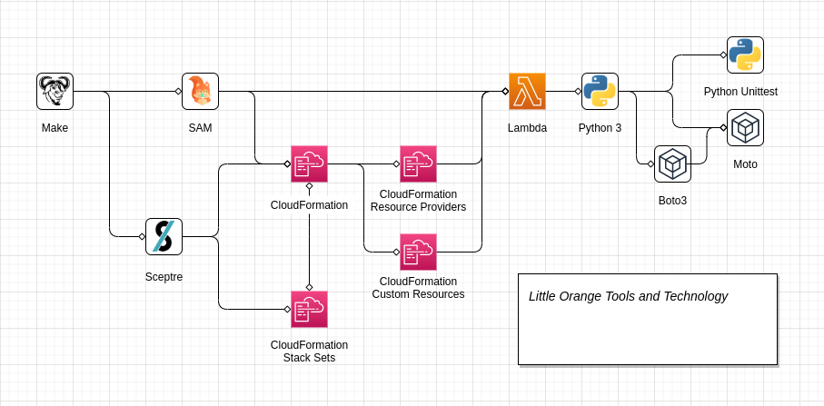

# Little Orange AWS

LittleOrange is a minimalist multi-account blueprint for AWS. It attempts to deliver patterns and services following best-practice in a clean, maintainable and decoupled implementation.

## Principles

## Tools and Implementation

| Tool                                                                                                                                 | For                 | Usage                                                                                                                                                                                                                                                                         |
| ------------------------------------------------------------------------------------------------------------------------------------ | ------------------- | ----------------------------------------------------------------------------------------------------------------------------------------------------------------------------------------------------------------------------------------------------------------------------- |
| [GNU Make](https://www.gnu.org/software/make/)                                                                                       | Orchestration       | Make is used to provide effective way to provide simple entrypoints for executing other tooling, and is readily available on most Linux-based systems                                                                                                                         |
| [CloudReach Sceptre](https://www.gnu.org/software/make/)                                                                             | Orchestration       | Sceptre is used to drive multi-stack **CloudFormation** deployments. Stack inputs are wired to outputs of other stacks which Sceptre can interpret and resolve as dependencies at deploy time. Sceptre also provides extensible "hooks" and "resolvers" written in **Python** |
| [AWS CloudFormation](https://aws.amazon.com/cloudformation/)                                                                         | Provisioning        | CloudFormation is AWS's mature Infrastructure-as-Code (IAC) provisioning tooling. CloudFormation is used to provision resources into the AWS Cloud                                                                                                                            |
| [AWS CloudFormation Stack Sets](https://docs.aws.amazon.com/AWSCloudFormation/latest/UserGuide/what-is-cfnstacksets.html)            | Provisioning        | Stack Sets provide tooling on top of **CloudFormation** to replicate stacks across many accounts and regions, this is used for deploying infrastructure like security guardrails and auditing tooling that needs to be maintained across the landscape                        |
| [AWS CloudFormation Custom Resources](https://docs.aws.amazon.com/AWSCloudFormation/latest/UserGuide/template-custom-resources.html) | Provisioning        | Custom Resources are used with **AWS Lambda** and **Python** to extend CloudFormation functionality and fill gaps in provisioning AWS resources                                                                                                                               |
| [AWS CloudFormation Resource Providers](https://docs.aws.amazon.com/cloudformation-cli/latest/userguide/resource-types.html)         | Provisioning        | Resource Providers provide a more verbose but more rigorous system for writing custom code to provision resources not yet supported natively in CloudFormation. Custom Resources are generally preferred due to the engineering effort required for a Resource Provider       |
| [AWS Lambda](https://aws.amazon.com/lambda/)                                                                                         | Code                | Lambda is used to provide serverless compute in the AWS Cloud, generally running **Python** to execute **CloudFormation Custom Resources**                                                                                                                                    |
| [AWS SAM](https://aws.amazon.com/serverless/sam/)                                                                                    | Provisioning + Code | AWS SAM (Serverless Application Model) is tooling used to improve developer experience of writing **AWS Lambda** functions and deploying them into AWS                                                                                                                        |
| [Python 3](https://www.python.org/)                                                                                                  | Code                | Python is used wherever custom imperative code is required. Python is preferred over something like Bash or Ansible as maintainability is higher, i.e. ability to write tests and validate change                                                                             |
| [Boto3](https://github.com/boto/boto3)                                                                                               | Code                | Boto3 is the official AWS SDK for **Python**, used to interact with AWS from custom code                                                                                                                                                                                      |
| [Moto](https://github.com/spulec/moto)                                                                                               | Testing             | Moto is a mocking library for **Boto3**, used to write tests around AWS-related **Python** code. Preferred                                                                                                                                                                    |
| [Botocore Stubber](https://botocore.amazonaws.com/v1/documentation/api/latest/reference/stubber.html)                                | Testing             | Botocore Stubber is a utility included in the Botocore library for writing custom stubs for **Boto3** for testing. Botocore Stubber is used when writing tests for **Python** code that use **Boto3** endpoints not covered by **Moto** mocks                                 |
| [Python Unittest](https://docs.python.org/3/library/unittest.mock.html)                                                              | Testing             | The **Python** unit testing library is used to hand-roll mocks for tests that cannot be covered by **Moto** or **Botocore Stubber**                                                                                                                                           |

## Features

[Features](./docs/Features.md)

## Roadmap

| Category      | Feature                  | Implementation                     |
| ------------- | ------------------------ | ---------------------------------- |
| DevOps        | Pipeline                 | CodePipeline, CodeBuild            |
| Organisations | Org, OUs, SCPs, Accounts | CloudFormation Resource Providders |

| Category        | Feature                                            | Implementation                                        | Progress            |
| --------------- | -------------------------------------------------- | ----------------------------------------------------- | ------------------- |
| Core            | CI/CD DevOps Pipeline                              | GitHub, CodeBuild                                     | `[==> ] 0%`         |
| Core            | Organizations                                      | CloudFormation Resource Providers                     | `[======> ] 60%`    |
| Core            | Account Creation and Onboarding                    | CloudFormation Resource Providers + Step Function     | `[ ] 0%`            |
| Core            | Cost and Usage Reports                             | `???`                                                 | `[ ] 0%`            |
| IAM             | Federated Login                                    | AWS SSO                                               | `[ ] 0%`            |
| IAM             | Delegated IAM                                      | IAM Permissions Boundary                              | `[ ] 0%`            |
| Logging + Audit | CloudTrail                                         | Cfn Stack + Custom Resource (for IsOrganizationTrail) | `[========> ] 80%`  |
| Logging + Audit | Config                                             | Cfn Stack + StackSet                                  | `[ ] 0%`            |
| Logging + Audit | GuardDuty                                          | Cfn Stack + StackSet                                  | `[=========> ] 90%` |
| Networking      | VPC Factory                                        | CloudFormation Macro, Service Catalogue               | `[ ] 0%`            |
| Networking      | Route 53 Hosted Zone (integrated with VPC Factory) | `???`                                                 | `[ ] 0%`            |
| Networking      | Route 53 Resolvers                                 | `???`                                                 | `[ ] 0%`            |
| Networking      | Transit Gateway                                    | `???`                                                 | `[ ] 0%`            |
| Networking      | Centralised VPC Endpoints                          | `???`                                                 | `[ ] 0%`            |
| Networking      | Centralised Egress                                 | Squid in Fargate                                      | `[ ] 0%`            |
| Cost Management | Instance Scheduling                                | `???`                                                 | `[ ] 0%`            |

- Automated account creation and onboarding
- GuardDuty
- CloudTrail
- Config
- Security Hub
- VPC Flow Logs
- Centralised CloudWatch Logging
- Automated Athena configuration/consumption of the above
- Delete default VPC
- CIS Compliance checks and autoremediation where possible
- SSM Patching (baseline scan and scaffold to implement)
- Instance scheduling
- Route 53 Resolvers
- Centralised VPC Endpoints (resolvable from workload VPCs)
- AWS SSO
- Developer IAM Role with Permissions Boundary
- VPC Factory via Service Catalogue

### AWS Organisations

- Create AWS Organisation
- Create SCPs
- Create OUs
- Assign SCPs to OUs
- Create accounts
- Assign accounts to OUs

### Python Unit Testing

Unit Testing of Python

- moto - https://github.com/spulec/moto - mock implementations of `boto3`
- Botocore Stubber - https://botocore.amazonaws.com/v1/documentation/api/latest/reference/stubber.html - provided stubbing in botocore
- Python Mocking - https://docs.python.org/3/library/unittest.mock.html - roll own mocking from scratch in Python (not preferred)

### A Note on Spelling for `AWS Organizations`

Being an Australian, correct spelling personally in this scenario would be "Organisation", but the fact it is also a service offering from AWS that features in APIs etc. complicates this somewhat. Therefore, to keep things consistent and in-line with [Principle of Least Surprise](https://en.wikipedia.org/wiki/Principle_of_least_astonishment) spelling in this repository is maintained as the American English equivalent of "Organization" when used in code or otherwise.
