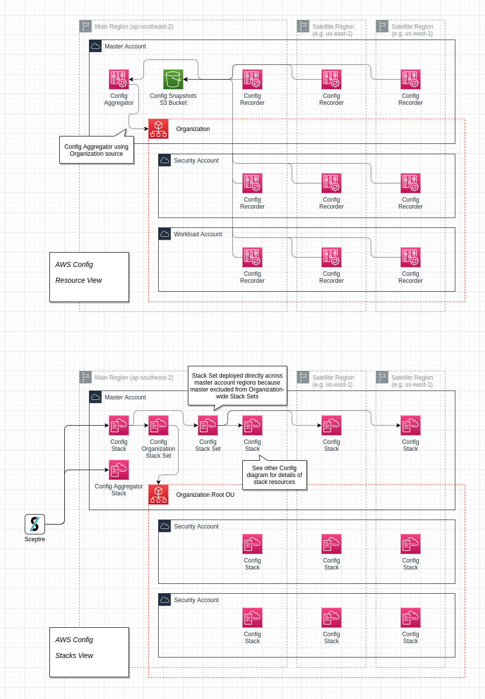
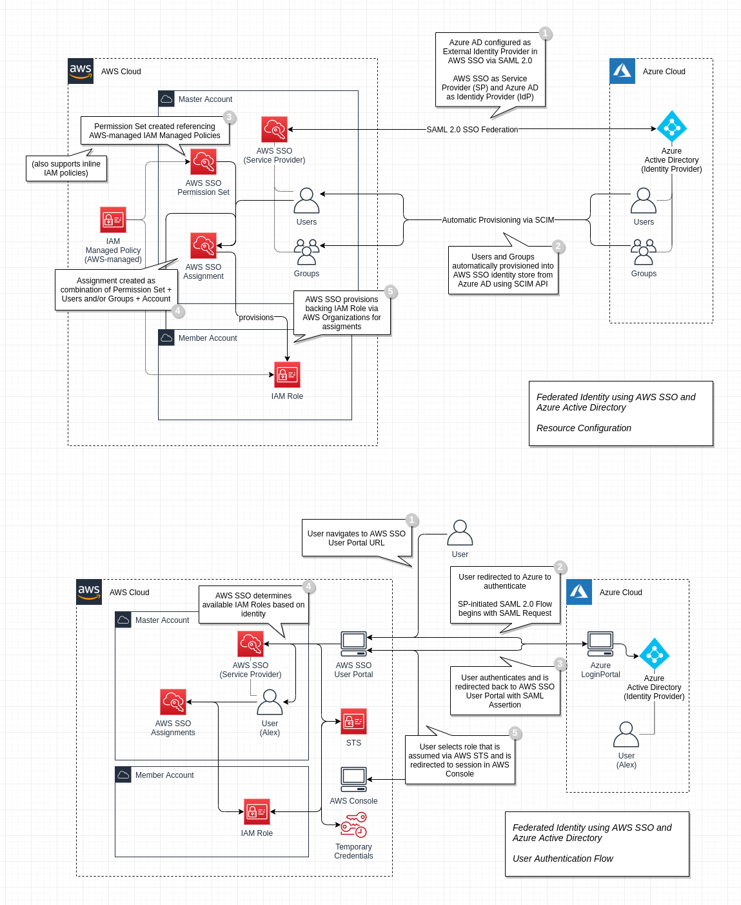
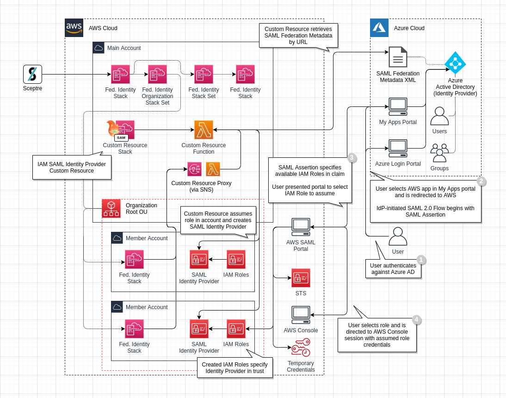

# Little Orange Features

## AWS SAM Support

## AWS CloudTrail

- CloudTrail trail deployed to `Core` account
- CloudTrail data delivered to S3 Bucket in `Core` account
- CloudTrail data delivered to CloudWatch Log Group in `Core` account
- Trail enabled as Organization trail via SAM Custom Resource

## AWS Config

- AWS Organisation Trusted Access enabled for Config and Config Rules
- `Security` account enabled as Delegated Administrator for Config Rules
- Config deployed across Organization via Stack Set deployed to `Core` account (and Stack Set for `Core` account directly)
- Config Aggregator and S3 Bucket for Config snapshots deployed to `Core` account

## AWS Organizations

- Declarative Organizations resource state in CloudFormation stack in `Core` account
- Organizations resource management via CloudFormation Resource Providers
  - `AWS::Organization::Organization`
  - `AWS::Organization::OrganizationalUnit`
  - `AWS::Organization::Account`
  - `AWS::Organization::ServiceControlPolicy`

## AWS GuardDuty

- `Security` account enabled as Delegated Administrator of Organization for GuardDuty
- GuardDuty Organization configuration via SAM Custom Resource in `Core` account
- GuardDuty enabled in all regions of `Security` account and auto-enable enabled via Stack Set in `Core` account
- Little Orange accounts specifically enrolled as GuardDuty member accounts via Stack Set in `Security` account

## AWS SecurityHub

- SecurityHub Hub deployed across Organization accounts and regions via Stack Set in `Core` account (and Stack Set for `Core` account directly)
- SecurityHub Hub deployed directly across `Security` account regions via Stack Set in `Security` account
- Onboarding of Hubs in all accounts as members of `Security` account Hub via SAM Custom Resource in `Core` account

## Federated Identify with AWS SSO

The below architecture is not implemented as part of Little Orange due to gaps in ability to automate configuration of AWS SSO. Currently, AWS SSO can only be configured via the AWS Console. The following guide presents a good ClickOps walk-through of configurating AWS SSO for federated identity with Azure Active Directory:

https://aws.amazon.com/blogs/aws/the-next-evolution-in-aws-single-sign-on/

## Federated Identity with IAM SAML Identity Provider

