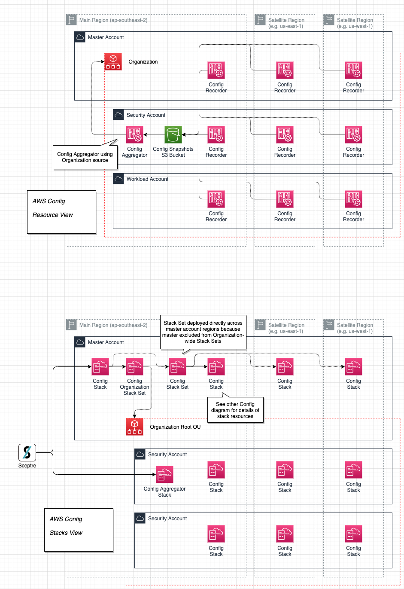
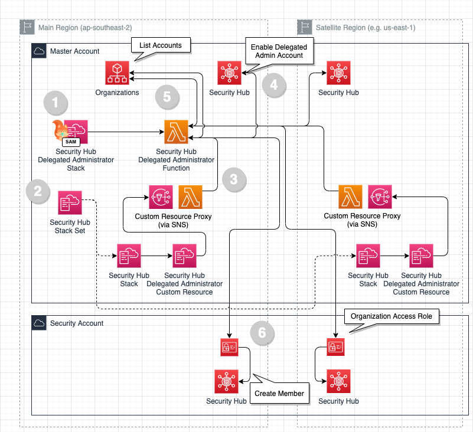
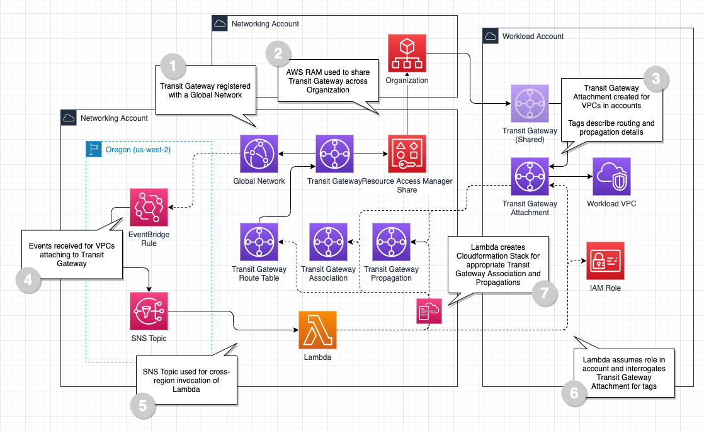

# Little Orange Features

This document describes the features implemented in the Little Orange project. Features are grouped into functional categories.

Perform a project search for the feature name to find where and how it is implemented.

- [Little Orange Features](#little-orange-features)
  - [1 Orchestration and Deployment](#1-orchestration-and-deployment)
    - [1.0 Project Orchestration with Make](#10-project-orchestration-with-make)
    - [1.1 Sceptre for CloudFormation Orchestration](#11-sceptre-for-cloudformation-orchestration)
      - [1.1.2 Sceptre Resolver Library](#112-sceptre-resolver-library)
      - [1.1.3 AWS SAM Build Integration Library](#113-aws-sam-build-integration-library)
    - [1.2 Linting of YAML and CloudFormation](#12-linting-of-yaml-and-cloudformation)
    - [1.3 Python Unit Testing](#13-python-unit-testing)
    - [1.4 AWS SDK Profiles Generation](#14-aws-sdk-profiles-generation)
    - [1.5 Deployment Automation from GitHub using CodeBuild (DevOps)](#15-deployment-automation-from-github-using-codebuild-devops)
      - [1.5.1 Pull Request Validation using CodeBuild](#151-pull-request-validation-using-codebuild)
    - [1.6 Dependency Management using Pipenv](#16-dependency-management-using-pipenv)
  - [2 Centralised AWS Management](#2-centralised-aws-management)
    - [2.1 Account Management with AWS Organizations](#21-account-management-with-aws-organizations)
      - [2.1.1 CloudFormation Resource Providers for AWS Organizations](#211-cloudformation-resource-providers-for-aws-organizations)
      - [2.1.2 Quarantine Organizational Unit (OU)](#212-quarantine-organizational-unit-ou)
    - [2.2 Resource Management with CloudFormation](#22-resource-management-with-cloudformation)
      - [2.2.1 CloudFormation Custom Resource Proxy](#221-cloudformation-custom-resource-proxy)
      - [2.2.2 CloudFormation Macro Proxy](#222-cloudformation-macro-proxy)
      - [2.2.3 CloudFormation Self-Managed Roles using CloudFormation Stack Sets](#223-cloudformation-self-managed-roles-using-cloudformation-stack-sets)
    - [2.3 Cost Management](#23-cost-management)
      - [2.3.1 Cost and Usage Reports](#231-cost-and-usage-reports)
      - [2.3.2 Querying of Cost and Usage Reports with Amazon Athena](#232-querying-of-cost-and-usage-reports-with-amazon-athena)
      - [2.3.3 Budget](#233-budget)
      - [2.3.4 Cost Explorer Anomaly Detection](#234-cost-explorer-anomaly-detection)
  - [3 Logging and Audit](#3-logging-and-audit)
    - [3.1 AWS CloudTrail](#31-aws-cloudtrail)
      - [3.1.1 CloudFormation Custom Resource for Organizations CloudTrail Support](#311-cloudformation-custom-resource-for-organizations-cloudtrail-support)
    - [3.2 AWS Config](#32-aws-config)
      - [3.2.1 Delegated Administrator for Config](#321-delegated-administrator-for-config)
  - [4 Identity and Access Management](#4-identity-and-access-management)
    - [4.1 Federated Identity with AWS SSO](#41-federated-identity-with-aws-sso)
    - [4.2 Federated Identity with IAM SAML Identity Provider](#42-federated-identity-with-iam-saml-identity-provider)
      - [4.2.1 CloudFormation Custom Resource for IAM SAML Identity Provider](#421-cloudformation-custom-resource-for-iam-saml-identity-provider)
  - [5 Security](#5-security)
    - [5.1 GuardDuty enabled across Organization](#51-guardduty-enabled-across-organization)
      - [5.1.2 Delegated Administrator for GuardDuty](#512-delegated-administrator-for-guardduty)
      - [5.1.3 CloudFormation Custom Resource for GuardDuty Organizations Support](#513-cloudformation-custom-resource-for-guardduty-organizations-support)
    - [5.2 Security Hub enabled across Organization](#52-security-hub-enabled-across-organization)
      - [5.2.1 CloudFormation Custom Resource for Security Hub Delegated Administrator](#521-cloudformation-custom-resource-for-security-hub-delegated-administrator)
  - [6 Networking](#6-networking)
    - [6.1 VPC Factory CloudFormation Macro](#61-vpc-factory-cloudformation-macro)
      - [6.1.1 VPC Factory deployment via Service Catalog](#611-vpc-factory-deployment-via-service-catalog)
      - [6.1.2 VPC Factory integration with Transit Gateway](#612-vpc-factory-integration-with-transit-gateway)
      - [6.1.3 VPC Factory integration with Centralised DNS](#613-vpc-factory-integration-with-centralised-dns)
      - [6.1.4 VPC Factory integration with Centralised VPC Endpoints](#614-vpc-factory-integration-with-centralised-vpc-endpoints)
    - [6.2 Transit Gateway for VPC Connectivity](#62-transit-gateway-for-vpc-connectivity)
      - [6.2.1 Automated Transit Gateway VPC attachment management](#621-automated-transit-gateway-vpc-attachment-management)
    - [6.3 Centralised DNS with Route53 Resolvers](#63-centralised-dns-with-route53-resolvers)
      - [6.3.1 CloudFormation Custom Resource for Route53 Resolver Endpoint Extended Output](#631-cloudformation-custom-resource-for-route53-resolver-endpoint-extended-output)
    - [6.4 Centralised VPC Endpoints](#64-centralised-vpc-endpoints)
    - [6.5 Managed CIDR Ranges with Prefix Lists](#65-managed-cidr-ranges-with-prefix-lists)
    - [6.6 Amazon Client VPN](#66-amazon-client-vpn)
  - [7 Workload Services](#7-workload-services)
  - [AWS SAM Support](#aws-sam-support)
  - [AWS Billing](#aws-billing)
  - [AWS CloudTrail](#aws-cloudtrail)
  - [AWS Config](#aws-config)
  - [AWS Organizations](#aws-organizations)
  - [AWS GuardDuty](#aws-guardduty)
  - [AWS SecurityHub](#aws-securityhub)
  - [Federated Identify with AWS SSO](#federated-identify-with-aws-sso)
  - [Federated Identity with IAM SAML Identity Provider](#federated-identity-with-iam-saml-identity-provider)
  - [VPC Factory with CloudFormation Macro](#vpc-factory-with-cloudformation-macro)
  - [Service Catalog for VPC Deployment](#service-catalog-for-vpc-deployment)
  - [Centralised DNS with Route 53 Resolver](#centralised-dns-with-route-53-resolver)
  - [Transit Gateway](#transit-gateway)

## 1 Orchestration and Deployment

### 1.0 Project Orchestration with Make

Useful entrypoints for project functions are documented as `make` targets. Utility functions are provided to aid project discoverability.

```
> make

+------------------------------------+
|        LITTLE ORANGE HELP          |
+------------------------------------+

Available targets:

Deploy                        Deploy Little Orange
DeployGitHubCredentials       Deploy stack to store GitHub credentials in Secrets Manager and create CodeBuild credentials
DeployPipeline                Deploy CodeBuild projects with webhook to run tests on GitHub pull requests and deploy on merge
...
```

> See also the _Tooling_ section of the main [README](../README.md).

### 1.1 Sceptre for CloudFormation Orchestration

[CloudReach Sceptre](https://www.gnu.org/software/make/) is used to provision all Little Orange resources through multi-stack CloudFormation deployments. Stack inputs are wired to outputs of other stacks which Sceptre can interpret and resolve as dependencies at deploy time to ensure all connected resources are kept in-sync. Sceptre also provides extensible "hooks" and "resolvers" written in Python to accommodate additional functionality.

The Sceptre config is separated into multiple Stack Groups (`Core`, `Security`, `Networking`, etc.) that correspond to the core AWS Accounts created as part of Little Orange. The Stack Group Config ([config.yaml](../sceptre/config/networking/../config.yaml)) within each specifies the AWS Profile that will be used to access each role.

> See also the _Tooling_ section of the main [README](../README.md).

#### 1.1.2 Sceptre Resolver Library

The [Sceptre Resolver Library](../lib/SceptreResolvers/README.md) provides useful [Sceptre Resolvers](https://sceptre.cloudreach.com/2.3.0/docs/resolvers.html) leveraged in Little Orange.

- `Command`: allows for arbitrary shell commands to be evaluated as part of parameters for stack deployments
- `UploadS3`: allows for assets to be uploaded to S3 and parameter resolved to S3 URI as part of stack deployments

#### 1.1.3 AWS SAM Build Integration Library

The [Sceptre Integration for AWS SAM](../lib/BuildSAM/README.md) provides a Python library for invoking AWS SAM project builds via `make` targets and reads in the resuling CloudFormation template.

The build integration library is invoked from an accompanying Python [BuildSAM.py](../sceptre/templates/BuildSAM.py) script to be invoked from the `template_path` of a Sceptre Stack Config. It implements a handler that invokes the integration library and returns the resulting template to be used in stack deployment.

### 1.2 Linting of YAML and CloudFormation

Linting of YAML files is performed by [yamllint](https://yamllint.readthedocs.io/en/stable/) and driven by `make`.

Linting of CloudFormation is performed by [cfn-lint](https://github.com/aws-cloudformation/cfn-lint) and driven bt `make`.

These tools help to ensure the correctness and robustness of the resources maintained within this project.

### 1.3 Python Unit Testing

Python unit tests are implemented using [pytest](https://docs.pytest.org/en/6.2.x/).

For code that interact with the [AWS SDK for Python](https://aws.amazon.com/sdk-for-python/), the following strategies are employed in order of preference:

- **moto** - https://github.com/spulec/moto - mock implementations of `boto3`
- **Botocore Stubber**- https://botocore.amazonaws.com/v1/documentation/api/latest/reference/stubber.html - provided stubbing in botocore
- **Python Mocking** - https://docs.python.org/3/library/unittest.mock.html - roll own mocking from scratch in Python (not preferred)

> See also the _Tooling_ section of the main [README](../README.md).

### 1.4 AWS SDK Profiles Generation

Little Orange includes a Python script to provide a programmatic way to generate AWS Profile entries for each account in the AWS Organization.

These AWS Profiles are named as required to drive the Sceptre deployment of Little Orange. A `make` target documents how to execute the script. This script also supports generating the AWS Profile entries required to deploy within the CodeBuild deployment automation.

```sh
# set an existing AWS Profile or provide credentials in environment to list accounts in the AWS Organization

# generate AWS Profiles and direct output to a file (to update profiles direct to ~/.aws/config)
make GenerateAWSProfiles >> ~/.aws/config.new

# generate AWS Profiles for use in ECS (executed by deployment automation)
make GenerateECSAWSProfiles >> ~/.aws/config.new
```

### 1.5 Deployment Automation from GitHub using CodeBuild (DevOps)

Little Orange deploys an integration between the GitHub repository and AWS CodeBuild to trigger deployment automation on new changes. CloudFormation (managed outside of the Sceptre deployment footprint) deploys the requisite infrastructure and configures credentials to access GitHub (credentials provided by user).

#### 1.5.1 Pull Request Validation using CodeBuild

Little Orange configures webhooks to trigger a build project for changes to Pull Requests (PRs) in the GitHub repository. This build project executes linting and validation checks to provide early feedback.

### 1.6 Dependency Management using Pipenv

Python dependencies are managed by [Pipenv](https://pipenv.pypa.io/en/latest/install/). This provides a simple way to track project dependencies and boostrap new copies of the project. Required Pipenv commands are maintained and documented as `make` targets.

> See also the _Tooling_ section of the main [README](../README.md).

## 2 Centralised AWS Management

Little Orange configures tools and services with a "core" management account that support the operation and maintenance of the AWS multi-account footprint.
### 2.1 Account Management with AWS Organizations

Little Orange manages multiple accounts via [AWS Organizations](https://aws.amazon.com/organizations/).
#### 2.1.1 CloudFormation Resource Providers for AWS Organizations

CloudFormation Resource Providers provide the ability to manage AWS Organizations resources. This allows for the structure of the AWS Organization to be defined declaratively using CloudFormation.

[Organizations.cfn.yaml](../sceptre/templates/Core/Organization.cfn.yaml)

#### 2.1.2 Quarantine Organizational Unit (OU)

The `Quarantine` OU allows for a compromised AWS Account to be detained and all access to AWS APIs revoked. The `Quarantine` OU has a Service Control Policy (SCP) attached that assigns `Deny` to all AWS IAM Actions.

### 2.2 Resource Management with CloudFormation

Little Orange provisions and manages all resources via the AWS CloudFormation service. Resources and services not natively supported by CloudFormation are implemented using CloudFormation Custom Resources or CloudFormation Resource Providers.
#### 2.2.1 CloudFormation Custom Resource Proxy

The CloudFormation Custom Resource Proxy allows for a single Custom Resource Lambda Function deployment to be leveraged from multiple accounts and regions. For Custom Resources implemented as AWS SAM projects this pattern is necessary as limitations exist for deploying the same AWS SAM template across many accounts or regions. The proxy is implemented as a lightweight, inlined Lambda Function that can be deployed across all accounts and regions -- Lambda-backed Custom Resources can only be invoked in the same account and region as the source CloudFormation Stack.

References:
- https://github.com/tomwwright/littleorange/issues/16
- https://github.com/tomwwright/littleorange/issues/15


- The CloudFormation Stack defines a Custom Resource using the Custom Resource Proxy deployed within the same account and region.
- The Custom Resource Proxy unwraps the actual target Custom Resource service token and parameters from the `Properties` payload.
- The Custom Resource Proxy is configured with the appropriate IAM Role to perform a cross-region, cross-account invoke of the Custom Resource Lambda Function.
- The `crhelper` library of the target Custom Resource handles completing the callback to CloudFormation for the resource.

#### 2.2.2 CloudFormation Macro Proxy


#### 2.2.3 CloudFormation Self-Managed Roles using CloudFormation Stack Sets

### 2.3 Cost Management

#### 2.3.1 Cost and Usage Reports

#### 2.3.2 Querying of Cost and Usage Reports with Amazon Athena

_TBC_

#### 2.3.3 Budget

#### 2.3.4 Cost Explorer Anomaly Detection

## 3 Logging and Audit

### 3.1 AWS CloudTrail

#### 3.1.1 CloudFormation Custom Resource for Organizations CloudTrail Support

### 3.2 AWS Config

#### 3.2.1 Delegated Administrator for Config

## 4 Identity and Access Management

### 4.1 Federated Identity with AWS SSO

### 4.2 Federated Identity with IAM SAML Identity Provider

#### 4.2.1 CloudFormation Custom Resource for IAM SAML Identity Provider

## 5 Security

### 5.1 GuardDuty enabled across Organization

#### 5.1.2 Delegated Administrator for GuardDuty

#### 5.1.3 CloudFormation Custom Resource for GuardDuty Organizations Support

### 5.2 Security Hub enabled across Organization

#### 5.2.1 CloudFormation Custom Resource for Security Hub Delegated Administrator

## 6 Networking

### 6.1 VPC Factory CloudFormation Macro

#### 6.1.1 VPC Factory deployment via Service Catalog

#### 6.1.2 VPC Factory integration with Transit Gateway

_TBC_

#### 6.1.3 VPC Factory integration with Centralised DNS

_TBC_
#### 6.1.4 VPC Factory integration with Centralised VPC Endpoints

_TBC_
### 6.2 Transit Gateway for VPC Connectivity

#### 6.2.1 Automated Transit Gateway VPC attachment management

### 6.3 Centralised DNS with Route53 Resolvers

#### 6.3.1 CloudFormation Custom Resource for Route53 Resolver Endpoint Extended Output

### 6.4 Centralised VPC Endpoints

### 6.5 Managed CIDR Ranges with Prefix Lists

### 6.6 Amazon Client VPN

_TBC_
## 7 Workload Services

_TBC_
## AWS SAM Support

## AWS Billing

- Cost and Usage Reports
- AWS Budget: forecasted and actual
- Cost Explorer Anomaly Detection: daily and weekly

## AWS CloudTrail

- CloudTrail trail deployed to `Core` account
- CloudTrail data delivered to S3 Bucket in `Core` account
- CloudTrail data delivered to CloudWatch Log Group in `Core` account
- Trail enabled as Organization trail via SAM Custom Resource

## AWS Config

- AWS Organisation Trusted Access enabled for Config and Config Rules
- `Security` account enabled as Delegated Administrator for Config Rules and Config
- Config deployed across Organization via Stack Set deployed to `Core` account (and Stack Set for `Core` account directly)
- Config Aggregator and S3 Bucket for Config snapshots deployed to `Security` account



## AWS Organizations

- Declarative Organizations resource state in CloudFormation stack in `Core` account
- Organizations resource management via CloudFormation Resource Providers
  - `AWS::Organization::Organization`
  - `AWS::Organization::OrganizationalUnit`
  - `AWS::Organization::Account`
  - `AWS::Organization::ServiceControlPolicy`

## AWS GuardDuty

- `Security` account enabled as Delegated Administrator of Organization for GuardDuty
- GuardDuty Organization configuration via SAM Custom Resource in `Core` account
- GuardDuty enabled in all regions of `Security` account and auto-enable enabled via Stack Set in `Core` account
- Little Orange accounts specifically enrolled as GuardDuty member accounts via Stack Set in `Security` account


## AWS SecurityHub

- SecurityHub Hub deployed across Organization accounts and regions via Stack Set in `Core` account
- Custom Resource registers `Security` account as Delegated Administrator for Security Hub and handles registering existing accounts as members



## Federated Identify with AWS SSO

The below architecture is not implemented as part of Little Orange due to gaps in ability to automate configuration of AWS SSO. Currently, AWS SSO can only be configured via the AWS Console. The following guide presents a good ClickOps walk-through of configurating AWS SSO for federated identity with Azure Active Directory:

https://aws.amazon.com/blogs/aws/the-next-evolution-in-aws-single-sign-on/


## Federated Identity with IAM SAML Identity Provider


## VPC Factory with CloudFormation Macro


## Service Catalog for VPC Deployment


## Centralised DNS with Route 53 Resolver


## Transit Gateway



